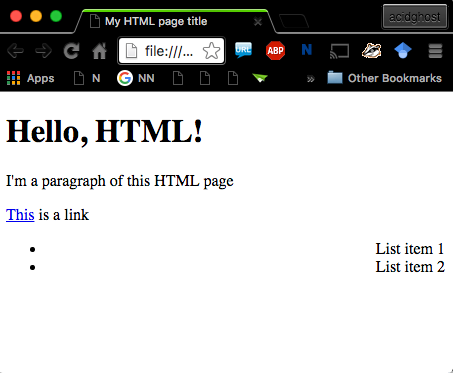
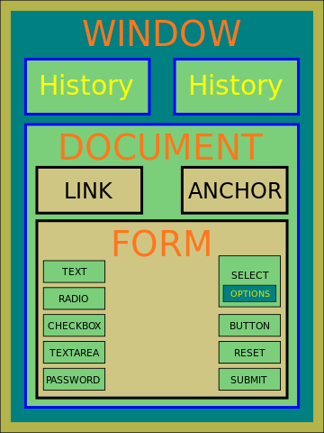

% Intro a JavaScript
% Andrea Jemmett
% S.O.S. + Coompany

# JavaScript

## Pillole

- lingua franca del Web
- consente di interagire con pagine HTML
- uno standard W3C (ECMAScript)
- (normalmente) vive all'interno di una pagina HTML

# Prerequisito: HTML

## Cos'è HTML?

- è un linguaggio di markup (e *non* di **programmazione**)
- uno standard W3C
    + ultima versione HTML5
- utile alla creazione della **struttura** di pagine Web

## Filosofia

- scinde la presentazione dalla struttura
    + anche se mette a disposizione **tag** come `<b></b>` o ``
- questa scissione rende possibile sviluppare un layer di presentazione diverso
  in base al dispositivo di visualizzazione (mediante **CSS**)

## L'elemento fondamentale

- HTML mette a disposizione una collezione di **tag**
- un tag ha forma `<tag attr1="value1" attr2="value2">...</tag>`
    + `tag` ha solitamente un significato semantico (h1, p, a, head, body, nav, section, ...)
    + attributi agiscono da modificatori
    + alcuni tag non accettano contenuto `<tag attr1="val1" />`
    + consente tag annidati `<tag1>Hello, <tag2>World!</tag2></tag1>`

## Una pagina HTML

~~~~~{.html .numberLines}
<!DOCTYPE html>
<html>
  <head>
    <title>My HTML page title</title>
  </head>
  <body>
    <h1>Hello, HTML!</h1>
    <!-- I'm a comment -->
    
I'm a paragraph of this HTML page

    
<a href="http://google.com">This</a> is a link

    

      <ul>
        <li>List item 1</li>
        <li>List item 2</li>
      </ul>
      
    

  </body>
</html>
~~~~~~~~~~~~~~~~~~~~~~~~~~~~~~~

------------------

## Tag comuni (1)

- `<html>` racchiude l'intero documento HTML
- `<head>` e `<body>` racchiudono l'intestazione (e metadati) ed il corpo rispettivamente
- headings: `<h1>`, `<h2>`, `<h3>`, `<h4>`, `<h5>`, `<h6>`
- horizontal rule: `
`
- paragraph: `
`
- line break: ` `
- text formatting: `<b>`, `<i>`, `<strong>`, `<em>`, ``, ``, ...
- quotations: `<abbr>`, `<address>`, `<blockquote>`, `<cite>`
- styling: `<style>`, `<link rel="css/stylesheet" />`
- graphics: `<canvas>`, `<svg>`

## Tag comuni (2)

- links: `<a>`
- media: ``, `<video>`, `<embed>`, `<iframe>`
- tables: `<table>`, `<thead>`, `<tbody>`, `<tfoot>`, `<tr>`, `<td>`
- lists: `<ul>`, `<ol>`, `<li>`, `<dl>`, `<dd>`, `<dt>`
- block and inline: `
`, ``
- layout: `<header>`, `<nav>`, `<section>`, `<article>`, `<aside>`, `<footer>`,
  `
`, `
`
- forms and input: `<form>`, `<input />`, `<textarea>`, `<button>`, `<submit>`,
  `<select>`, `<option>`

## References

> - [http://www.w3schools.com/html/default.asp](http://www.w3schools.com/html/default.asp)
> - [https://www.w3.org/html/](https://www.w3.org/html/)

# Document Object Model (DOM)   {#dom}

## Cos'è il DOM?

- un modello per descrivere pagine Web
- standard W3C
- indipendente da browser
- fornisce un API per interagire con una pagina Web ed i suoi componenti

------------------

# JavaScript in dettaglio

## Caratteristiche

- case sensitive (someName &ne; somename)
- è un linguaggio di scripting
- tipizzazione dinamica
- basato su oggetti (*non classi!*)

## Eseguire JS

``

- normalmente prima del tag di chiusura `</body>`
- raramente prima del tag di chiusura `</head>`

## Tipi di dato

- non è tipizzato ma comunque esistono i tipi di dato
    * primitivi
        + numerico (`int` o `float`)
        + booleano (`true`, `false`)
        + stringa (`"hello"` o `'hello'`)
    * strutture dati
        + array
        + oggetti
    * speciali
        + `undefined`
        + `null`

## Variabili

- è una *scatola* che può contenere un istanza di un qualsiasi tipo di dato
- il valore contenuto può cambiare durante l'esecuzione del programma
- dichiarata tramite la keyword `var`

## Variabili: esempio

~~~~~~{.js .numberLines}
var myVariable = "this is a string";
var myInteger = (10 * 2) / 3;   // usuali op. numerici

myVariable = 42;
myInteger = myVariable;

console.log("myVariable ha valore", myVariable);
console.log("myInteger ha valore " + myInteger);
~~~~~~~~~~~~~~~~~~~~~~~~~~~
[https://jsfiddle.net/acidghost/bw9vr0en/](https://jsfiddle.net/acidghost/bw9vr0en/)

## Array

- è una collezione di valori (anche non omogenei)
- accessibili tramite un indice (da `0` ad `n`)
- dimensione dinamica

## Array: esempio

~~~~~~{.js .numberLines}
var myArray = [1, 2, 3, 4],
    matrix = [[1, '2', 3.2],
              [true, 'array', 'stringa'],
              [true, false, null]];

console.log(myArray[0]);     // primo elemento -> 1
console.log(myArray[2]);     // terzo elemento -> 3
console.log(matrix[2][2]);   // terza riga, terza colonna -> null

myArray[0] = 0;              // setta il valore
~~~~~~~~~~~
[https://jsfiddle.net/acidghost/sq9v3tu8/](https://jsfiddle.net/acidghost/sq9v3tu8/)

## Oggetti

- principale tipo di dato in JS
- una struttura con:
    + proprietà
    + metodi

## Oggetti: esempio

~~~~~~{.js .numberLines}
var array = new Array(1, '123');

console.log(array.length);    // proprietà
array.push(10);               // metodo
~~~~~~~~~
[https://jsfiddle.net/acidghost/9op4jxfs/](https://jsfiddle.net/acidghost/9op4jxfs/)

## Oggetti: esempio

~~~~~~{.js .numberLines}
var myObj = new Object();
myObj.myProp = 42;
myObj.myMethod = function() {
  return 'I\'m a method!';
};
console.log(myObj);
console.log(myObj.myMethod());

var myObj2 = {
  myProp: 42,
  myMethod: function() {
    return 'I\'m a method!';
  }
};
console.log(myObj2);
console.log(myObj2.myMethod());
~~~~~~~~
[https://jsfiddle.net/acidghost/4rz25y74/](https://jsfiddle.net/acidghost/4rz25y74/)

## Funzioni

- consentono il riuso del codice
- hanno uno scope
- sono cittadini di primo livello
    + JS supporta funzioni di ordine superiore

## Funzioni: esempio

~~~~~~{.js .numberLines}
var greet = function(name) {
  var nameArr = name.split('');
  nameArr[name.length - 1] = 'z';
  name = nameArr.join('');
  return 'Hello, ' + name + '!';
};
console.log(greet('Andrea'));

function greet2(name) {
  return 'Hello, ' + name + '!';
};
console.log(greet2('Andrea'));
~~~~~~~~~
[https://jsfiddle.net/acidghost/axbgbm0t/](https://jsfiddle.net/acidghost/axbgbm0t/)

## Funzioni: scoping

~~~~~~{.js .numberLines}
var integer = 3;
var square = function() {
  integer *= integer;
};
square();
console.log(integer);		// 9
var square2 = function(integer) {
  return integer *= integer;
};
square();
console.log(integer);		// 81

integer = square2(3);
console.log(integer);		// 9
~~~~~~~~~
[https://jsfiddle.net/acidghost/91ezf1bu/](https://jsfiddle.net/acidghost/91ezf1bu/)

## Condizioni

- blocco if-else
- comparazione (`!=`, `==`, `>`, `<`, `>=`, `<=`)
- operatori booleani (`&&`, `||`, `!`)

## Tavole di verità

A    B    A `&&` B
---  ---  ---
0    0      0
0    1      0
1    0      0
1    1      1

## Tavole di verità

A    B    A `||` B
---  ---  ---
0    0      0
0    1      1
1    0      1
1    1      1

## Tavole di verità

A    `!`A
---  ---
0    1
1    0

## Condizioni: esempio

~~~~~~{.js .numberLines}
var n = 42;
if (n == 42) {
  console.log('n ha valore 42');
} else {
  console.log('n non ha valore 42');
}

var k = 'stringa';
if (n == k || n >= 42) {
  console.log('blocco if');
} else {
  console.log('blocco else');
}
~~~~~~~~~
[https://jsfiddle.net/acidghost/L093mcnv/](https://jsfiddle.net/acidghost/L093mcnv/)

## Beware!

- l'operatore `===` esegue uguaglianza su valore + tipo!
- `5 == '5'` -> `true`
- `5 === '5'` -> `false`
- preferibile, ma con attenzione

## Condizioni: op. ternario

~~~~~~{.js .numberLines}
var n = 42;
var k = n == 42 ? 'n = 42' : 'n != 42';
console.log(k);
~~~~~~~~~
[https://jsfiddle.net/acidghost/hhtwqg7k/](https://jsfiddle.net/acidghost/hhtwqg7k/)

## Switch

~~~~~~{.js .numberLines}
var n = 42;
switch (n) {
  case 1:
    console.log('n == 1');
    break;
  case 42:
    console.log('n == 42');
    break;
  // .....
  default:
    console.log('n ==' + n);
}
~~~~~~~~~
[https://jsfiddle.net/acidghost/ktu5juLf/](https://jsfiddle.net/acidghost/ktu5juLf/)
